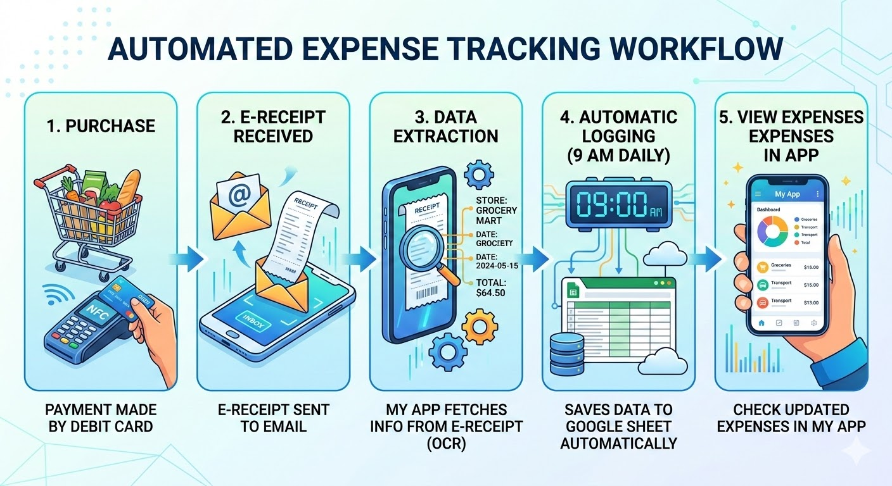

# 📧 Receipt Automation Pipeline

An automated system that reads receipt emails from Outlook,
extracts transaction data using regex parsing, and stores it
in Google Sheets for tracking and visualization.

Built as a portfolio project to demonstrate end-to-end
automation pipeline skills.

---

## ✨ Features

- Automatically fetches receipt emails from Outlook (Hotmail)
- Extracts key fields: date, store, amount, currency, approval number
- Saves data to Google Sheets 
- Interactive dashboard with spending charts (Streamlit)
- Runs daily via GitHub Actions — fully automated

---

## 🛠️ Tech Stack

| Layer | Tool |
|---|---|
| Email Access | Microsoft Graph API (O365) | Read emails from Hotmail |
| Parsing | Python regex |
| Storage | Google Sheets (gspread) |
| Dashboard | Streamlit | Visualize spending data |
| Automation | GitHub Actions |

---

## 📁 Project Structure

receipt-automation-pipeline/
├── .github/
│   └── workflows/
│       └── daily_run.yml        ← GitHub Actions schedule
├── src/
│   ├── email_fetcher.py         ← Connect to Outlook via O365
│   ├── parser.py                ← Extract fields with regex
│   └── sheets_writer.py        ← Write data to Google Sheets
├── dashboard/
│   └── app.py                   ← Streamlit dashboard
├── .env.example                 ← Credentials template
├── requirements.txt             ← Python dependencies
└── README.md

## 🚀 How It Works

1. GitHub Actions triggers the script every morning
2. Script connects to Outlook via Microsoft Graph API (O365 library)
3. Filters emails from @jp-post.jp (Yucho Bank debit receipts)
4. Regex extracts transaction fields from email body:
   - 利用日時 → date & time
   - 利用店舗 → store name
   - 利用金額 → amount
   - 利用通貨 → currency
   - 承認番号 → approval number
5. New rows appended to Google Sheets (duplicates skipped)
6. Streamlit dashboard reads Sheets and displays charts

---

## 🔐 Authentication

This project uses **Microsoft Entra App Registration** to
authenticate with Outlook. The app requires these API permissions:
- `Mail.Read` — read emails from the inbox
- `offline_access` — maintain connection without re-login

Credentials are stored in a `.env` file (never committed to GitHub).

## ⚙️ Setup

(You will fill this in during Week 3 when everything works)

---

## 📊 Dashboard Preview

(Add screenshot here in Week 3)

---

