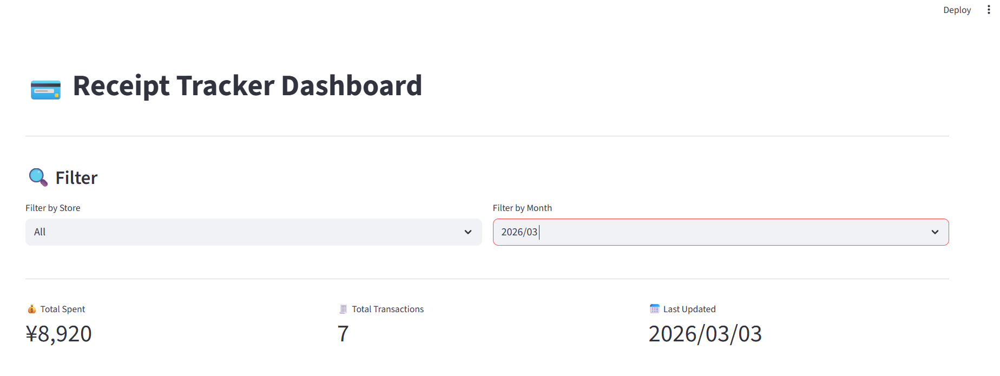
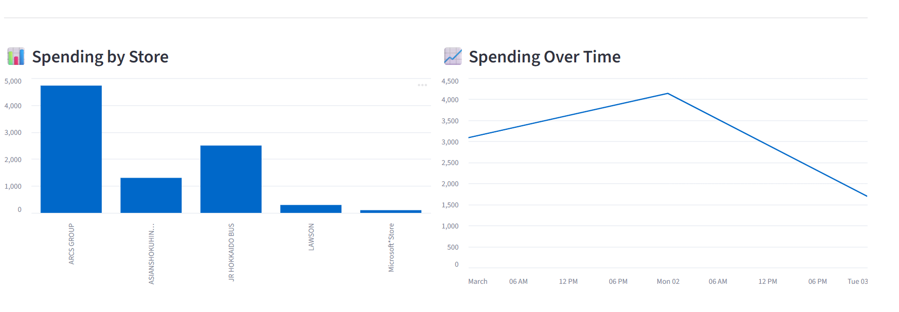
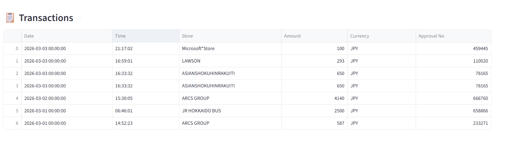

# 📧 Receipt Automation Pipeline

This is just a personal project!

An automated system that reads receipt emails from Outlook,
extracts transaction data using regex parsing, and stores it
in Google Sheets for tracking and visualization.


---

## 📊 Dashboard Preview





##  ❤️ About

◦The problem!

The problem is: Financial data is trapped inside emails — hard to track, hard to analyze, easy to forget.
Your app solves it by: Automatically collecting all that data in one place so you can see your spending clearly without doing anything manually.

◦What I learned

GitHub Actions — how to make code run automatically on a schedule in the cloud without computer being on
API Authentication — how apps get permission to access accounts securely (OAuth, tokens, secrets)
Regex — how to find and extract specific patterns from text
End-to-end thinking — connecting multiple services together (email → Python → Google Sheets → dashboard)
Security practices — .gitignore, secrets management, never committing credentials

◦What features could add in the future?

LINE notification — send a message to your LINE app every time a new receipt is saved
Category tags — label each store as Food, Transport, Shopping etc.
Multi-currency support — handle receipts in different currencies if you travel.

## ✨ Features


1.Purchase: After shopping, I make a payment using my debit card.
2.E-Receipt: An electronic receipt is automatically sent to my email.
3.Extraction: My app fetches the transaction details directly from the e-receipt.
4.Automation: The data is saved to a Google Sheet every day at 9:00 AM.
5.Review: I can view and manage all my expenses directly within my app.

---

## 🛠️ Tech Stack

 Email - Access  Microsoft Graph API (O365)  Read emails from Hotmail 
 Parsing - Python regex 
 Storage - Google Sheets (gspread) 
 Dashboard - Streamlit  Visualize spending data 
 Automation - GitHub Actions 

---

## 📁 Project Structure

```
receipt-automation-pipeline/
├── .github/
│   └── workflows/
│       └── daily_run.yml        ← GitHub Actions schedule
├── src/
│   ├── email_fetcher.py         ← Connect to Outlook via O365
│   ├── parser.py                ← Extract fields with regex
│   └── sheets_writer.py        ← Write data to Google Sheets
├── dashboard/
│   └── app.py                   ← Streamlit dashboard
├── .env.example                 ← Credentials template
├── requirements.txt             ← Python dependencies
└── README.md
```


## 🚀 How It Works

1. GitHub Actions triggers the script every morning
2. Script connects to Outlook via Microsoft Graph API (O365 library)
3. Filters emails from @jp-post.jp (Yucho Bank debit receipts)
4. Regex extracts transaction fields from email body:
   - 利用日時 → date & time
   - 利用店舗 → store name
   - 利用金額 → amount
   - 利用通貨 → currency
   - 承認番号 → approval number
5. New rows appended to Google Sheets (duplicates skipped)
6. Streamlit dashboard reads Sheets and displays charts


---

## 🔐 Authentication

This project uses **Microsoft Entra App Registration** to
authenticate with Outlook. The app requires these API permissions:
- `Mail.Read` — read emails from the inbox
- `offline_access` — maintain connection without re-login

Credentials are stored in a `.env` file (never committed to GitHub).


